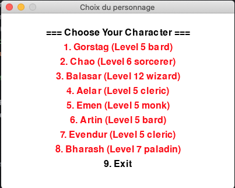
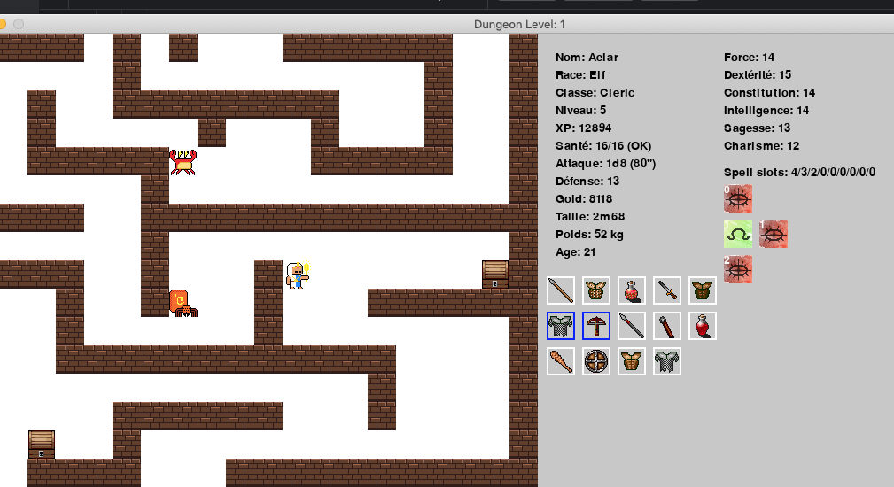

<!-- TOC -->
* [Menu principal](#menu-principal)
* [Jeu](#jeu)
* [Commandes](#commandes)
<!-- TOC -->

# Menu principal

# Jeu

# Commandes
- Déplacements: touches Haut/Bas/Gauche/Droite
- Memorisation Sort: `LEFT CLICK` sur sort
- Equip weapon/armor: `LEFT CLICK` on item in char's inventory
- Drop weapon/armor: `RIGHT CLICK` on non-equipped item in char's inventory
- Attaques:
  - `LEFT CLICK` on visible monster in range of weapon
  - `RIGHT CLICK` on visible monster in range of spell
- Drink potion:
  - `P` key or `LEFT CLICK` on potion
- Quit Game:
  - `ESC` key
- Rest, Gain level: *only in console game's version yet*
