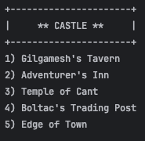
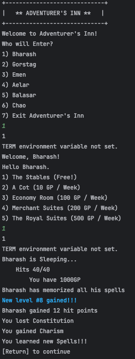
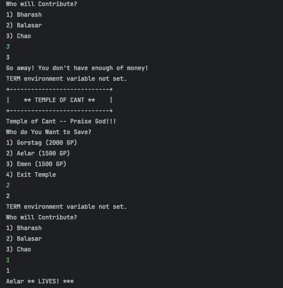
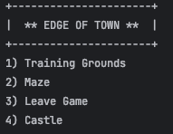
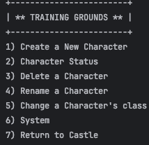
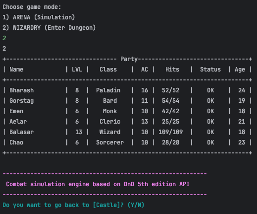
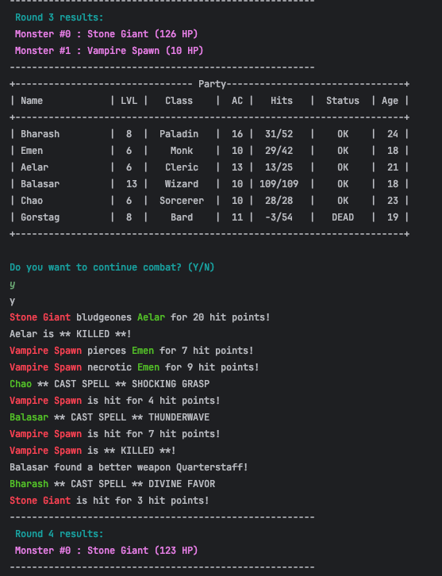
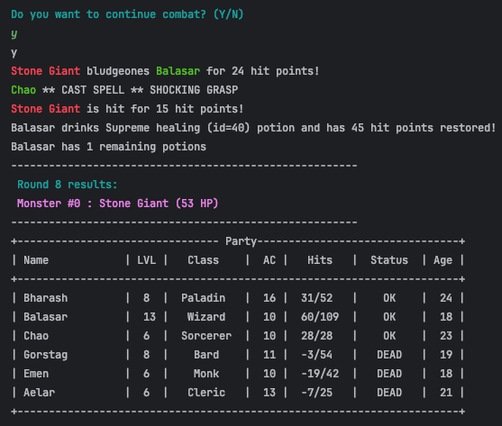
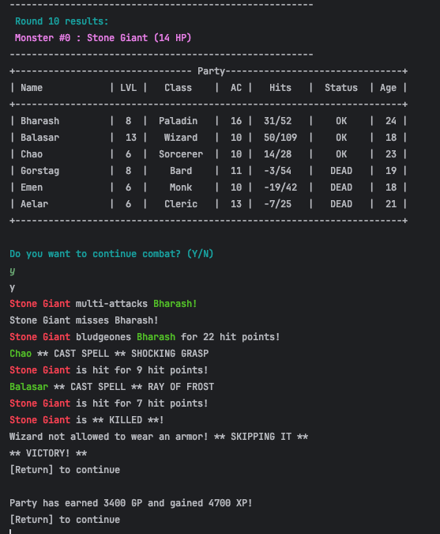

Combat simulation engine based on DnD 5th edition API

<!-- TOC -->
* [CASTLE](#castle)
  * [GILGAMESH's TAVERN](#gilgameshs-tavern)
    * [CHARACTER STATUS](#character-status)
  * [ADVENTURER's INN](#adventurers-inn)
  * [TEMPLE OF CANT](#temple-of-cant)
  * [BOLTAC's TRADING POST](#boltacs-trading-post)
* [EDGE OF TOWN](#edge-of-town)
  * [TRAINING GROUNDS](#training-grounds)
  * [MAZE](#maze)
  * [LEAVE GAME](#leave-game)
<!-- TOC -->

# CASTLE



## GILGAMESH's TAVERN

    maximum 6 personnages par groupe d'aventuriers

  ```
  +----------------------------------------------------------------- Party------------------------------------------------------------------+
| Name            | LVL |   Class    |  AC |   Hits   |  Status  | Age | Kills |                     Highest monster                      |
+-----------------------------------------------------------------------------------------------------------------------------------------+
| Kava            |  18 |  Fighter   |  20 |  89/115  |    OK    |  32 |  186  |       Androsphinx (AC 17 HD: 19d10 HP: -15 CR: 17)       |
| Jassan          |  16 |   Cleric   |  17 |  45/86   |    OK    |  25 |   82  |        Gynosphinx (AC 17 HD: 16d10 HP: -1 CR: 11)        |
| Patrin          |  14 | Barbarian  |  17 |   1/82   |    OK    |  34 |  116  |       Androsphinx (AC 17 HD: 19d10 HP: -13 CR: 17)       |
| Jheri           |  12 |  Warlock   |  16 |  22/79   |    OK    |  31 |  132  |        Gynosphinx (AC 17 HD: 16d10 HP: -4 CR: 11)        |
+-----------------------------------------------------------------------------------------------------------------------------------------+
  ```


### CHARACTER STATUS

  ```
  +-------------- Jassan (age: 25 - OK)---------------+
| str: 18 | int: 18 | hp:  45 / 86  | CLERIC        |
| dex: 18 | wis: 11 | xp: 218328    | Half-Elf      |
| con: 18 | cha: 20 | level: 16     | AC: 17        |
+---------------------------------------------------+
|                    kills = 82                     |
|     armors in use = Shield + Half Plate Armor     |
|  weapon in use = Crossbow, Light - Damage = 1d8   |
|                 gold = 34879.0 gp                 |
+---------------------------------------------------+
|          spell slots: 4/3/3/3/1/1/1/1/0           |
|                  8 known spells:                  |
|            Sacred Flame dc: dex lvl: 0            |
|          Inflict Wounds dc: None lvl: 1           |
|           Guiding Bolt dc: None lvl: 1            |
|         Spiritual Weapon dc: None lvl: 2          |
|         Guardian of Faith dc: dex lvl: 4          |
|           Control Water dc: str lvl: 4            |
|           Insect Plague dc: con lvl: 5            |
|            Flame Strike dc: dex lvl: 5            |
+---------------------------------------------------+


Options: 
1. View Inventory 
2. Equip/Unequip Armor 
3. Equip/Unequip Weapon 
4. Trade Equipment 
5. Drop Equipment 
6. Monster kills 
7. Return
  ```

## ADVENTURER's INN



## TEMPLE OF CANT



## BOLTAC's TRADING POST

  ```
  +--------------------------------+
|  ** BOLTAC'S TRADING POST **   |
+--------------------------------+
	Welcome to Boltac's!
	  Hello, Kava!

1) Buy
2) Sell
3) Pool Gold
--------
0) Exit
2
Which item to you want to sell?
	You Have 35378.95 GP.

1) Longsword (15 gp)
2) Dart (5 cp)
3) Cloud Giant Strength (42057 gp)
4) Lance (10 gp) (Equipped)
5) Fire Giant Strength (776 gp)
6) Shield (10 gp) (Equipped)
7) Plate Armor (1500 gp) (Equipped)
  ```

# EDGE OF TOWN



## TRAINING GROUNDS



## MAZE









## LEAVE GAME

    Bye, see you in a next adventure :-)

