Combat simulation engine based on DnD 5th edition API

<!-- TOC -->
* [CASTLE](#castle)
  * [GILGAMESH's TAVERN](#gilgameshs-tavern)
    * [CHARACTER STATUS](#character-status)
  * [ADVENTURER's INN](#adventurers-inn)
  * [TEMPLE OF CANT](#temple-of-cant)
  * [BOLTAC's TRADING POST](#boltacs-trading-post)
* [EDGE OF TOWN](#edge-of-town)
  * [TRAINING GROUNDS](#training-grounds)
  * [MAZE](#maze)
  * [LEAVE GAME](#leave-game)
<!-- TOC -->

# CASTLE

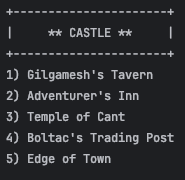

## GILGAMESH's TAVERN

    maximum 6 personnages par groupe d'aventuriers

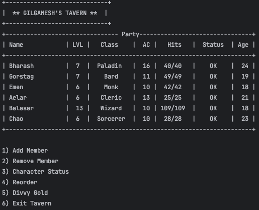

### CHARACTER STATUS

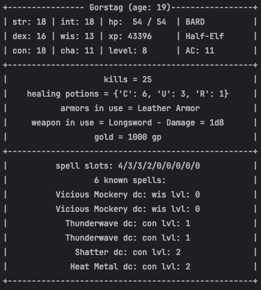

## ADVENTURER's INN

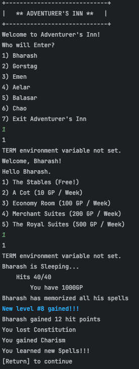

## TEMPLE OF CANT

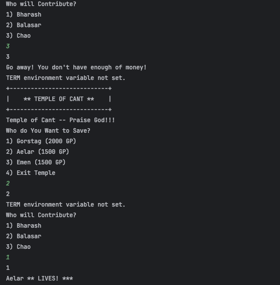

## BOLTAC's TRADING POST

not yet implemented!...

# EDGE OF TOWN

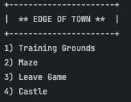

## TRAINING GROUNDS

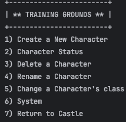

## MAZE

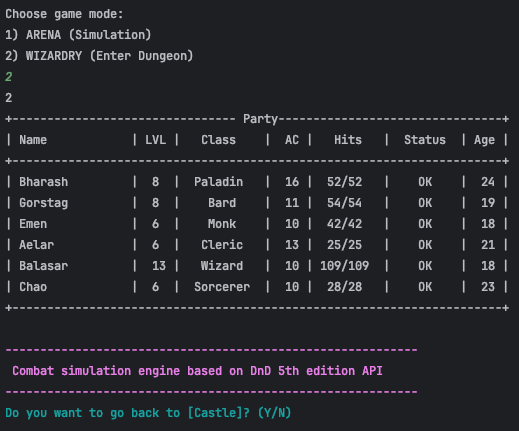

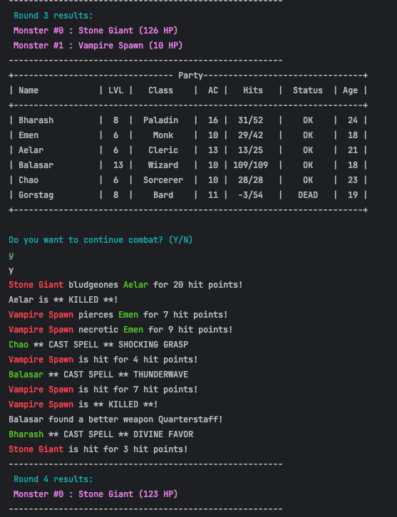

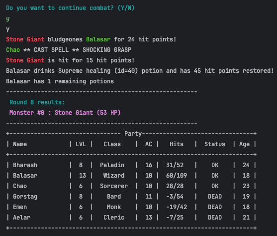

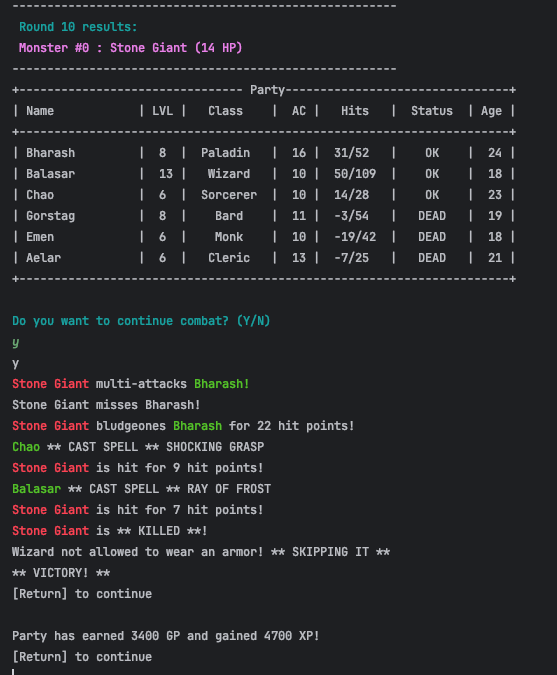

## LEAVE GAME

    Bye, see you in a next adventure :-)

