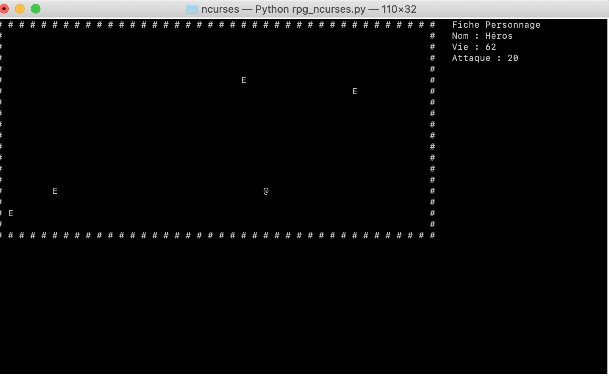
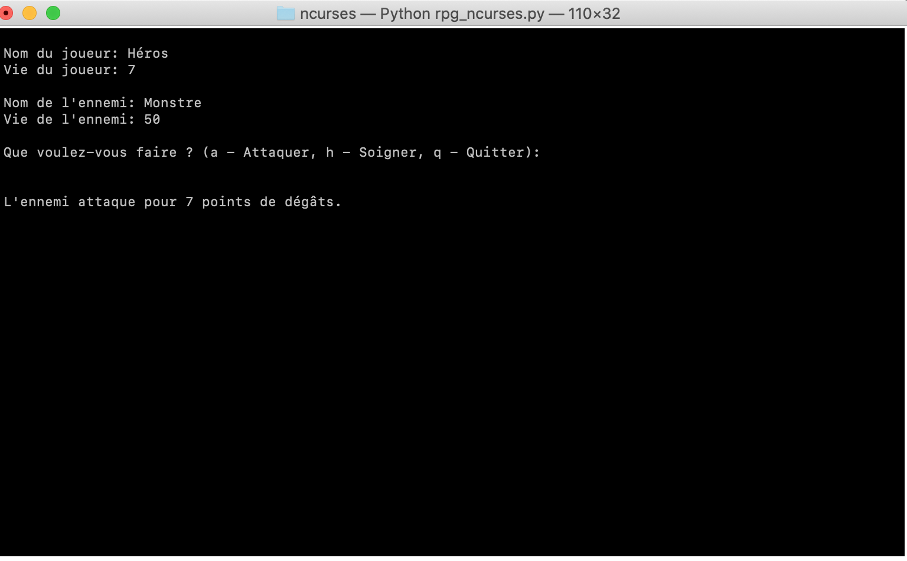

<!-- TOC -->
* [Commandes](#commandes)
* [Gameplay](#gameplay)
<!-- TOC -->

# Commandes
- Déplacements: touches Haut/Bas/Gauche/Droite ou Z/S/Q/D
- Attaques:
  - Déplacement sur ennemi
- Quit Game:
  - `ESC` key (pas de sauvegarde du personnage)
  
# Gameplay

