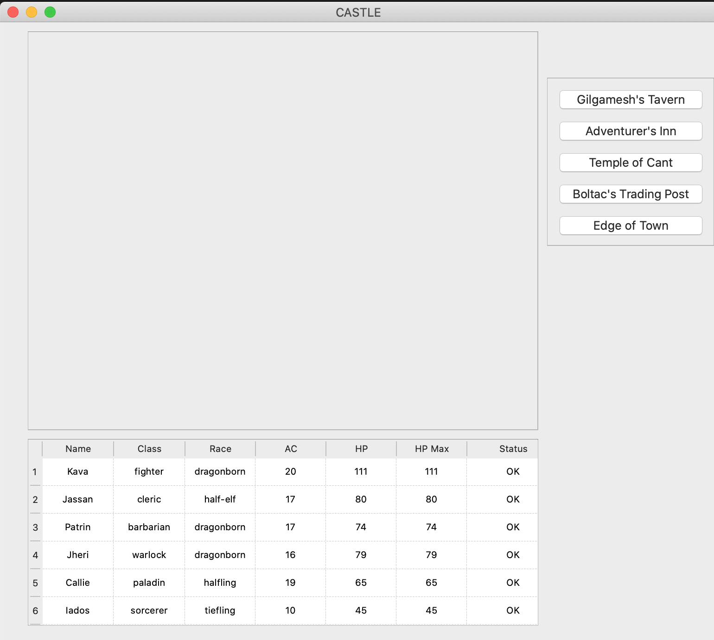
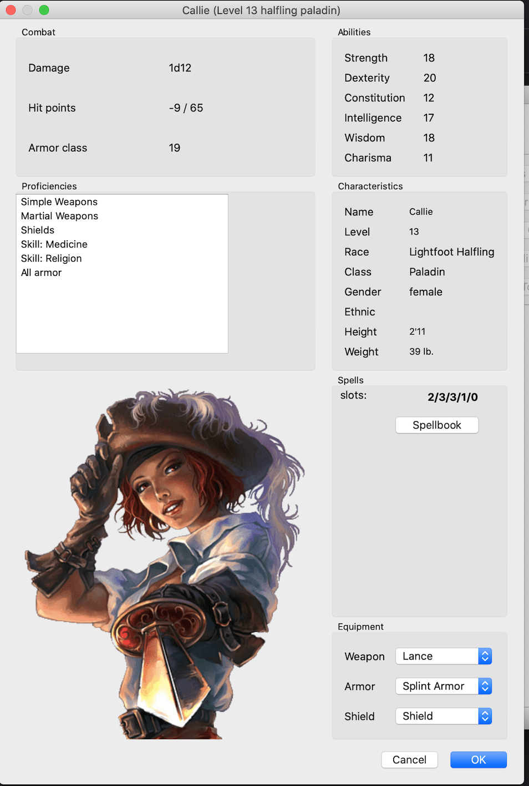
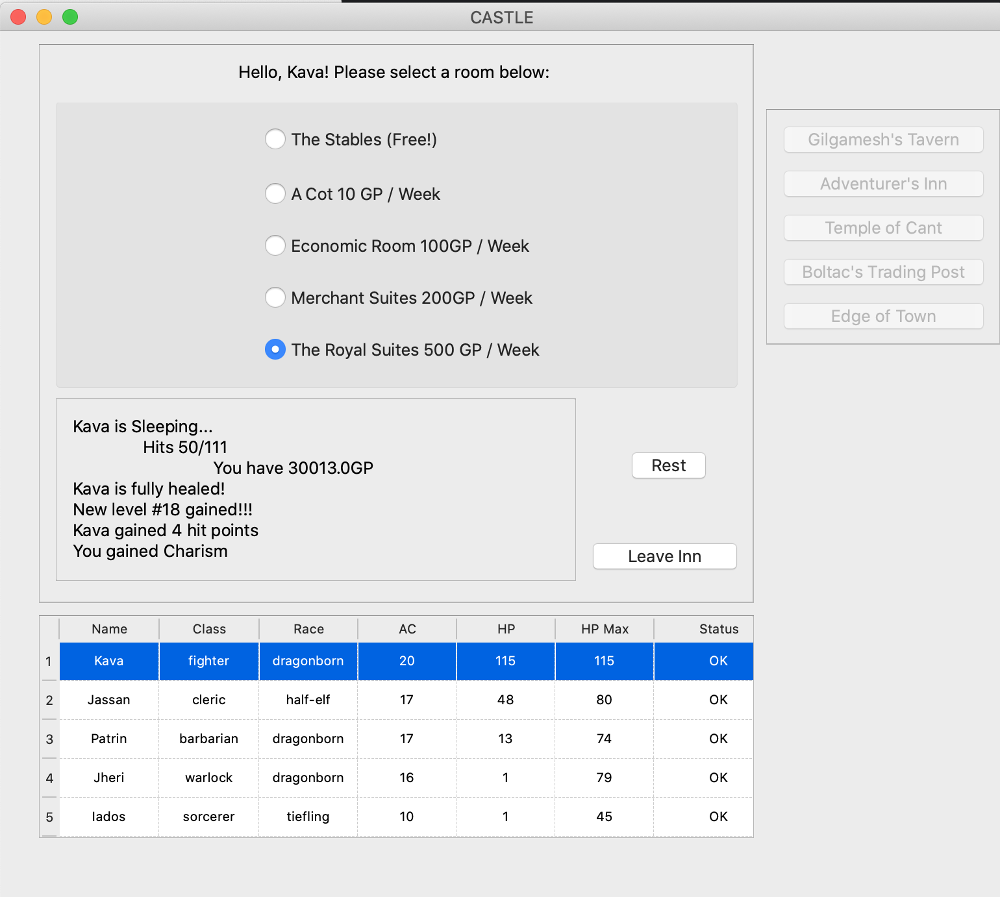
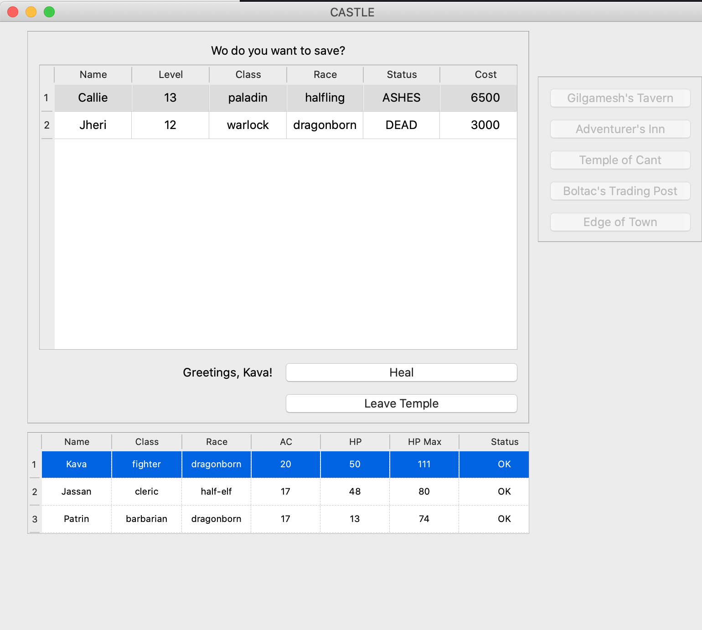
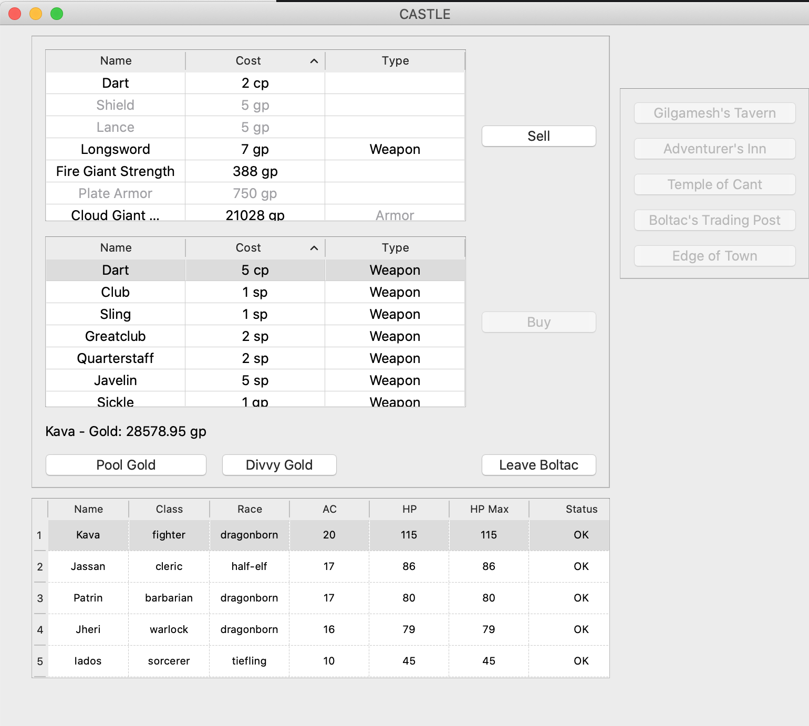
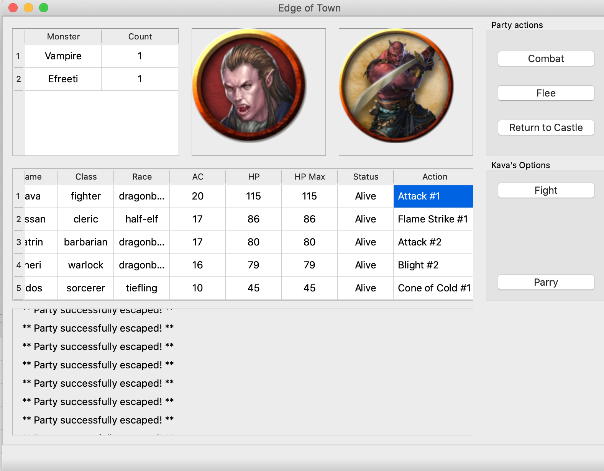
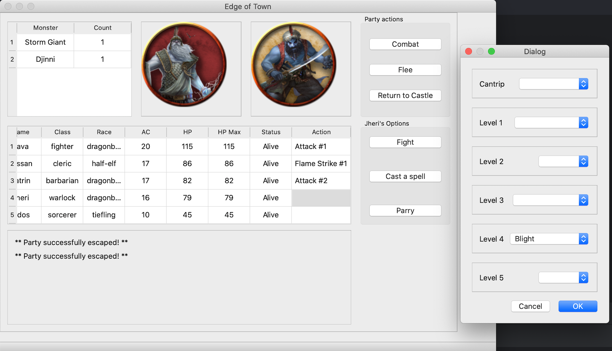

Combat simulation engine based on DnD 5th edition API

<!-- TOC -->
* [CASTLE](#castle)
  * [GILGAMESH's TAVERN](#gilgameshs-tavern)
    * [CHARACTER STATUS](#character-status)
  * [ADVENTURER's INN](#adventurers-inn)
  * [TEMPLE OF CANT](#temple-of-cant)
  * [BOLTAC's TRADING POST](#boltacs-trading-post)
* [EDGE OF TOWN](#edge-of-town)
  * [TRAINING GROUNDS](#training-grounds)
  * [MAZE](#maze)
  * [LEAVE GAME](#leave-game)
<!-- TOC -->

# CASTLE

  * Starting screen showing last party (same widget used inside Castle window)
  * Navigation frame to the right to display other widgets belonging to Castle window, and button to open edge of Town window

## GILGAMESH's TAVERN (CASTLE)

  * Add/Remove character to/from party (maximum 6 characters for a party)

### CHARACTER STATUS

  * Equip/Unequip weapon & armors 
  * View spellbook

## ADVENTURER's INN (CASTLE)

  * Rest (restore HP & spell slots, gain level) 

## TEMPLE OF CANT (CASTLE)

  * Heal (Raise Dead)

## BOLTAC's TRADING POST (CASTLE)

  * Buy/Sell weapon, armors and potions (except for equipped weapon & armors)

# EDGE OF TOWN

  * Combat arena (1 or 2 groups of different monster's types)
  * Melee/ranged attacks (Fight)
  * Spell's attack (only spells reducing hp's monster implemented yet)
  * Spell's defense (cure hp of any party's member)
  * Flee option (in case of encounter's level is too difficult)
  * Return to castle
  * Leave Game (accessible from menu only)

## TRAINING GROUNDS (EDGE OF TOWN)

not yet implemented!...

## MAZE (EDGE OF TOWN)

see `Edge of Town` section

## LEAVE GAME (EDGE OF TOWN)

see `Edge of Town` section

    Bye, see you in a next adventure :-)

