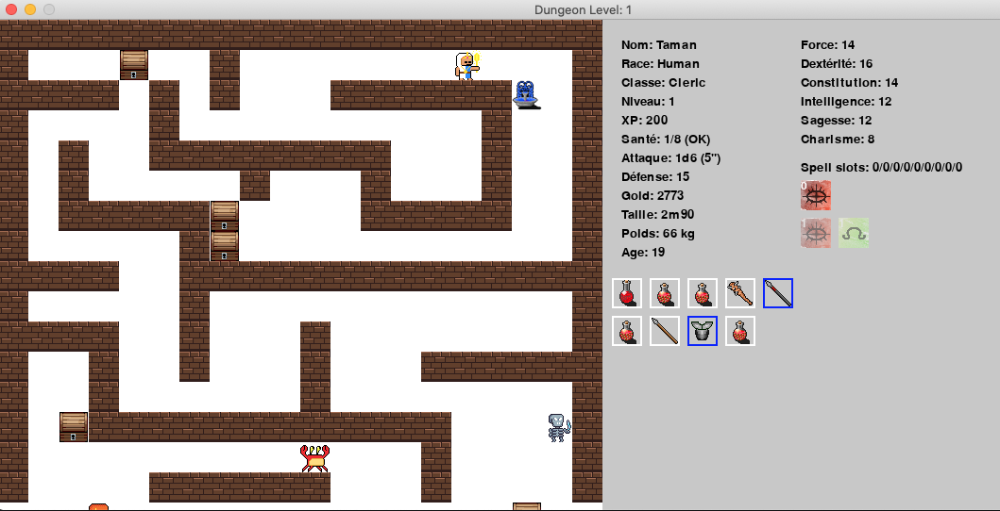

<!-- TOC -->
* [Menu principal](#menu-principal)
* [Jeu](#jeu)
* [Commandes](#commandes)
* [Tips](#tips)
<!-- TOC -->

# Menu principal

# Jeu

# Commandes
- Déplacements: touches Haut/Bas/Gauche/Droite
- Memorisation Sort: `LEFT CLICK` sur sort
- Equip weapon/armor: `LEFT CLICK` on item in char's inventory
- Drop weapon/armor: `RIGHT CLICK` on non-equipped item in char's inventory
- Attaques: (&#8505; attaque et déplacement des monstres réactivées)
  - `LEFT CLICK` on visible monster in range of weapon
  - `RIGHT CLICK` on visible monster in range of spell
- Sorts de guérison:
  - `RIGHT CLICK` on character sprite to cast healing spell (for eligible characters)
- Doors:
  - Open door: `O` key
  - Close door: `C` key
- Rooms & Corridors:
  - Inspect: `I` key
- Character:
  - Gather position/status of hero: `H` key
- Drink potion:
  - Healing: `P` key or `LEFT CLICK` on potion
  - Speed: `S` key or `LEFT CLICK` on potion
  - Strength: `LEFT CLICK` on potion
- Save current game & character state:
  - `CMD-S (Apple) - Windows-S (PC)` key
- Recover spell slots/gain level: *MOVE* to fountain
- Quit Game (without saving current game):
  - `ESC` key or `event_close` window
- Show this help:
  - `H` key

# Tips
- les sorts de niveau 0 ne consomment pas d'unité de sort (*spell_slot*)
- les fontaines permettent de recharger les unités de sorts et de monter de niveau si XP suffisants
- seuls les sorts d'attaque et sorts de récupération de PdV sont disponibles dans le grimoire (pour l'instant)
- le niveau du sort est indiqué en incrustation dans l'icône du sort
- La portée d'une arme est indiquée en face du dé de dommages (1 case = 5")
- la portée d'un sort est affichée en survolant l'icône du sort dans le grimoire
- les armes/armures équipés ou sort mémorisés sont entourés d'un rectangle bleu
- Il est possible de porter un bouclier en plus d'une armure (sauf si le personnage porte une arme à 2 mains)
