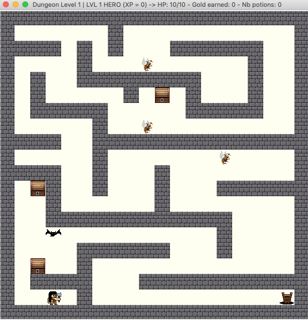

<!-- TOC -->
* [Jeu](#jeu)
* [Commandes](#commandes)
<!-- TOC -->

# Jeu

# Commandes
- Déplacements: touches Haut/Bas/Gauche/Droite
- Attaques:
  - Déplacement sur ennemi (NB: les ennemis se dirigent vers l'ennemi et l'attaquent si dans le champ de visibilité)
  - &#9888; chaque monstre a une vitesse de déplacement différente
- Drink potion:
  - `P` key
- Quit Game:
  - `ESC` key (pas de sauvegarde du personnage)
